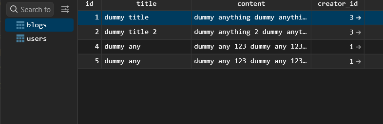
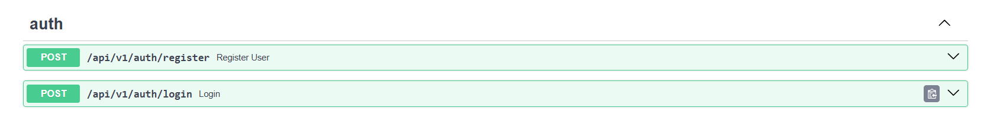
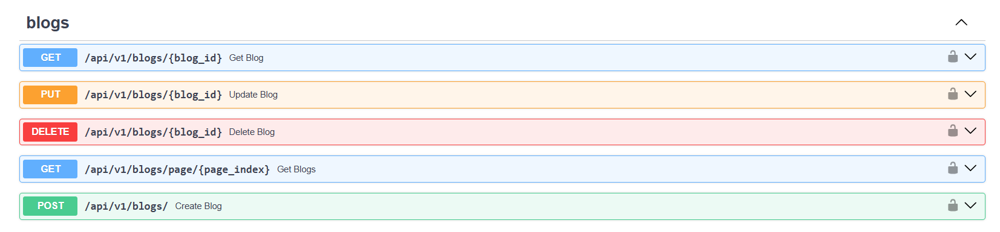
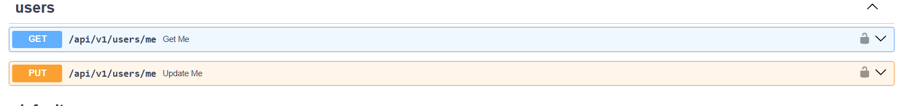
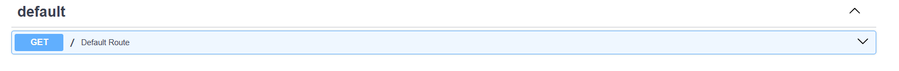
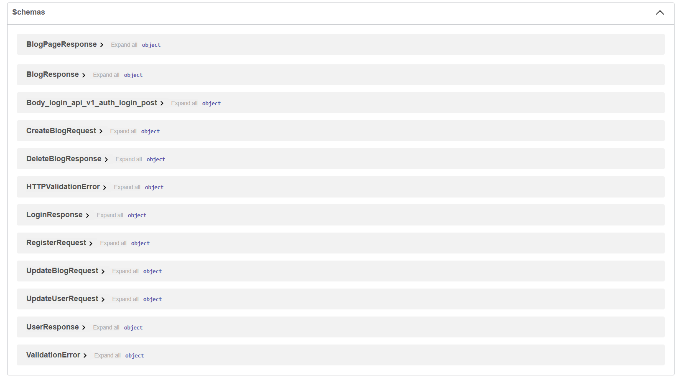

# Blogs Backend Full System

A modular, scalable, and secure backend API for user and blog management built with **FastAPI**, **SQLAlchemy**, and *
*JWT authentication**. This project demonstrates a clean architecture approach with separation of concerns between
repositories, services, data sources, and response handling.

---

## Table of Contents

* [Features](#features)
* [Architecture](#architecture)
* [Installation](#installation)
* [Configuration](#configuration)
* [Usage](#usage)
* [API Endpoints](#api-endpoints)
* [Project Structure](#project-structure)
* [Preview Images](#preview-images)

---

## Features

* **User Management**: Registration, login, and profile updates
* **Blog Management**: CRUD operations for blogs
* **JWT Authentication**: Secure login and token verification
* **Data Validation**: Email, password, and request body validation
* **Database Abstraction**: SQLAlchemy with SQLite (or configurable DB)
* **Error Handling**: Centralized error management with `Failure` class
* **Dependency Injection**: Singleton service locator (`Sl`)
* **Pagination**: Retrieve blogs in pages

---

## Architecture

The project follows a **clean architecture** with the following layers:

1. **Infrastructure Layer**

    * Database provider (`DBProvider`) with session management
    * Environment configuration (`Env`)

2. **Data Layer**

    * SQLAlchemy models (`UserModel`, `BlogModel`)
    * Data sources (`CacheDataSourceAlChemyImpl`) for DB operations
    * Services: `HashService`, `JWTService`

3. **Domain Layer**

    * Repository interfaces: `AuthRepository`, `BlogRepository`, `UserRepository`
    * Data mappers for transforming models to response objects

4. **Application Layer**

    * API routes (FastAPI)
    * Request/response schemas (Pydantic models)
    * Validators for input fields
    * Response processing with `ResponseProcess`

---

## Installation

1. Clone the repository:

```bash
git clone https://github.com/YosefSamy019/blogs_backend_full_project.git
cd blogs_backend_full_project
```

2. Create a virtual environment:

```bash
python -m venv venv
source venv/bin/activate  # Linux/macOS
venv\Scripts\activate     # Windows
```

3. Install dependencies:

```bash
pip install -r requirements.txt
```

---

## Configuration

Create a `.env` file in the root directory with the following variables:

```env
IS_DEBUG=1
SQL_ALCHEMY_DB_URL=sqlite:///./db.sqlite3
SQL_ALCHEMY_DB_ECHO=1
SECRET_KEY=your-secret-key
ALGORITHM=HS256
PAGE_SIZE=10
```

---

## Usage

Run the FastAPI server:

```bash
uvicorn src.app.main:app --reload
```

The API will be available at:

```
http://127.0.0.1:8000/
```

You can access the auto-generated documentation at:

```
http://127.0.0.1:8000/docs
```

---

## API Endpoints

### Auth

* `POST /api/v1/auth/register` – Register a new user
* `POST /api/v1/auth/login` – Login and get JWT token

### Users

* `GET /api/v1/users/me` – Get current user profile
* `PUT /api/v1/users/me` – Update user profile

### Blogs

* `GET /api/v1/blogs/{blog_id}` – Retrieve a blog
* `GET /api/v1/blogs/page/{page_index}` – Retrieve paginated blogs
* `POST /api/v1/blogs/` – Create a new blog
* `PUT /api/v1/blogs/{blog_id}` – Update a blog
* `DELETE /api/v1/blogs/{blog_id}` – Delete a blog

All routes requiring authentication use JWT Bearer tokens.

---

## Project Structure

```
src/
├─ app/
│  ├─ main.py              # FastAPI entry point
│  ├─ routes/              # API routers
│  │  ├─ v1/
│  │  │  ├─ auth.py
│  │  │  ├─ blogs.py
│  │  │  └─ users.py
│  │  └─ oauth.py
│  ├─ requests/            # Request Pydantic models
│  ├─ responses/           # Response Pydantic models
│  └─ validators/          # Input validators
├─ data/
│  ├─ datasources/         # DB data source implementations
│  ├─ repository_impl/     # Repository implementations
│  ├─ services/            # Hashing & JWT services
│  └─ models/              # SQLAlchemy models
├─ domain/
│  ├─ mappers/             # Model -> Response mappers
│  └─ repository/          # Repository interfaces
├─ infrastructure/
│  └─ alchemy_sql.py       # SQLAlchemy setup
└─ shared/
   ├─ env.py               # Env singleton
   ├─ either.py            # Either pattern (Left/Right)
   └─ sl.py                # Singleton service locator
```

---

## Preview Images

*  – **Blogs Table**
*  – **Users Table**
*  – **auth endpoints**
*  – **blogs endpoints**
*  – **users endpoints**
*  – **default endpoints**
*  – **schemas responses**

---


